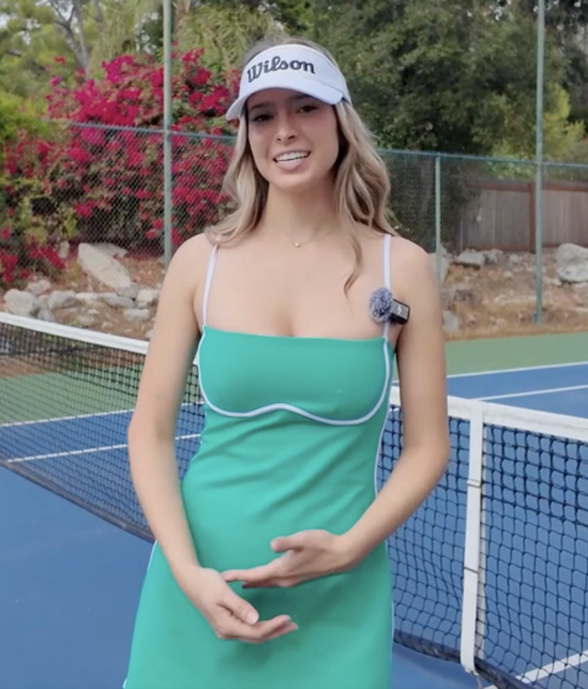
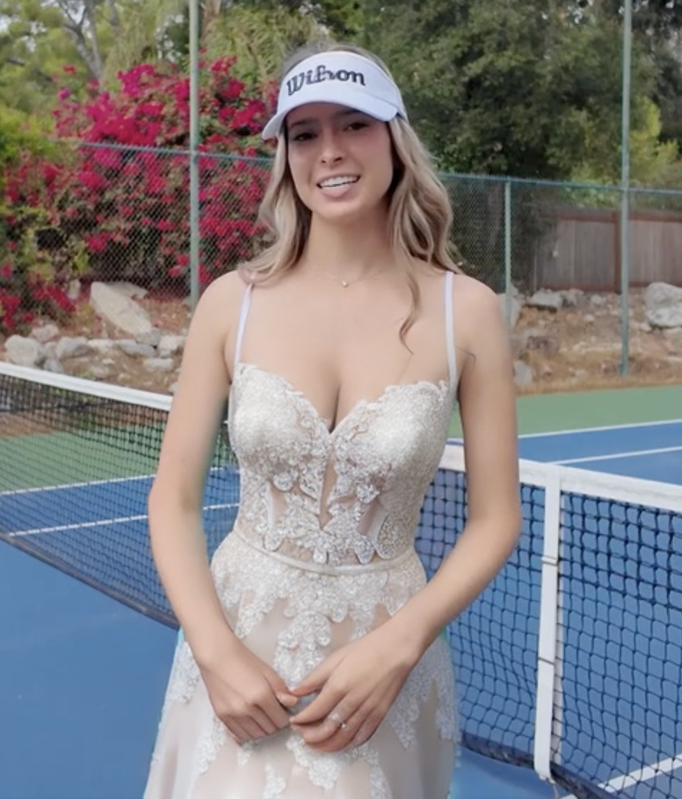
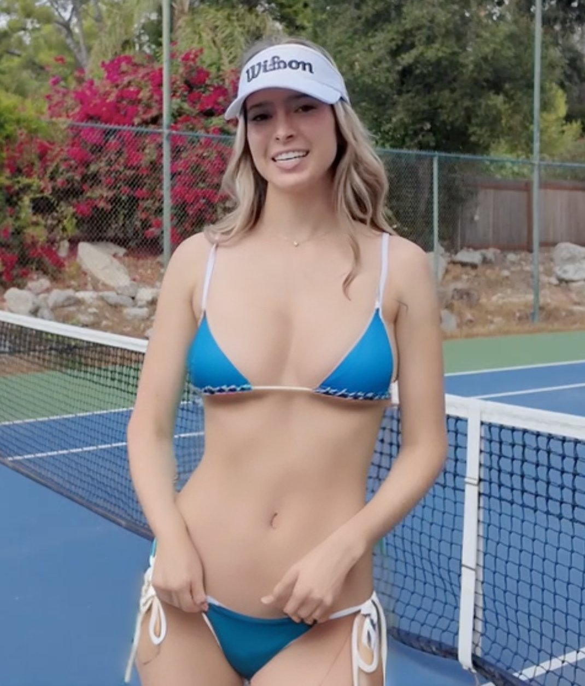

# AIBox Image — OpenClaw Skill

Transform photos using [AIBox](https://aiboxlab.us) presets: change outfits, undress, enhance.

## Setup

1. Get an API key from AIBox
2. Add `AIBOX_API_KEY=<your-key>` to `.env` (or `.env.local` for overrides)
3. Install as an OpenClaw skill

## Examples

**Original** → **Wedding** → **Bikini**

  
  
  

## Disclaimer

This is an unofficial community skill. It is not affiliated with, endorsed by, or associated with AIBox Lab in any way.
